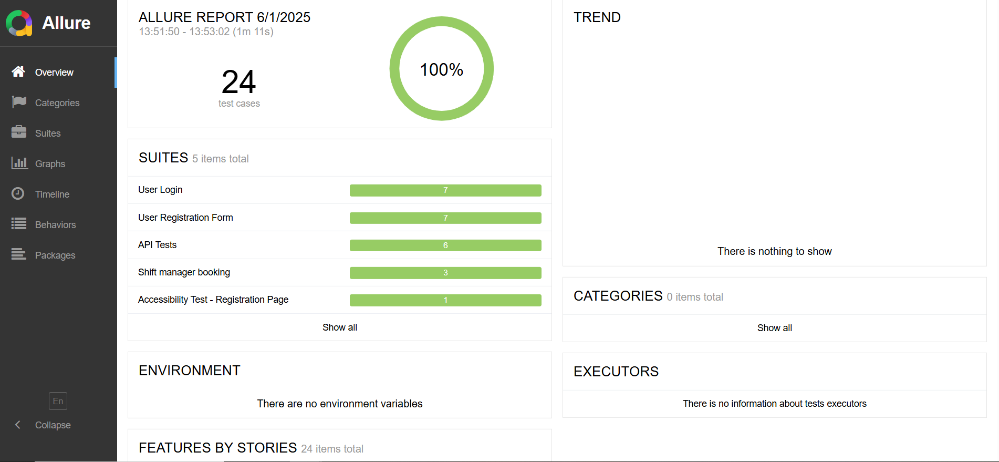

# QA Automation Technical Test

This project is a full-stack test automation suite for a sample web application using Cypress. It includes:

- ✅ Frontend UI tests (Login, Registration, Accessibility)
- ✅ Backend API tests (User and Shift management)
- ✅ Allure reporting
- ✅ Cross-browser execution (Chrome, Edge, Firefox)
- ✅ Page Object Model (POM) structure

---

## ✅ All Tests Passed

This project uses Cypress with Allure Reporting to validate both frontend and backend functionality.



- **Total Tests:** 24  
- **Passed:** 24  
- **Failed:** 0  
- **Suites Covered:**  
  - User Login  
  - User Registration  
  - Shift Management  
  - Backend API Tests  
  - Accessibility Testing (Axe-core)  
- **Cross-browser tested:** Chrome, Edge, Firefox  
- **Reporting Tool:** Allure

---

## 📁 Folder Structure

```bash
cypress/
├── e2e/
│   ├── Backend-API-Tests/
│   │   └── apiTest.cy.js
│   ├── Frontend-UI-Tests/
│   │   ├── accessibility/
│   │   │   └── accessibilityTest.cy.js
│   │   ├── auth/
│   │   │   ├── login.test.cy.js
│   │   │   └── registration.test.cy.js
│   │   └── shifts/
│   │       └── shift-management.test.cy.js
│   ├── fixtures/
│   │   └── loginUsers.json
│   └── support/
│       ├── pageObjects/
│       │   ├── LoginPage.js
│       │   ├── RegisterPage.js
│       │   └── ShiftPage.js
│       └── utils/
│           ├── commands.js
│           ├── e2e.js
│           └── environs.js
```

## 🚀 How to Run Tests

### 1. Install Dependencies

```bash
npm install
```
### 2. Run All Tests with Allure Reporting

```bash
npm run cypress:test:allure
```
### 3. View Allure Report

```bash
npm run cypress:report
```
### 4. Cross-Browser Testing

```bash
npm run cypress:test:chrome
npm run cypress:test:edge
npm run cypress:test:firefox
```

---

## 📊 Coverage Report (Static Badge)


---

## 🧪 Tools & Libraries

- [Cypress](https://www.cypress.io/)
- [Allure Reports](https://docs.qameta.io/allure/)
- [Axe-Core Accessibility](https://github.com/dequelabs/axe-core)
- [Cypress Real Events](https://github.com/dmtrKovalenko/cypress-real-events)

---

## 👤 Author

Akan Antia  
📧 [akan_antia@live.co.uk]  
🔗 